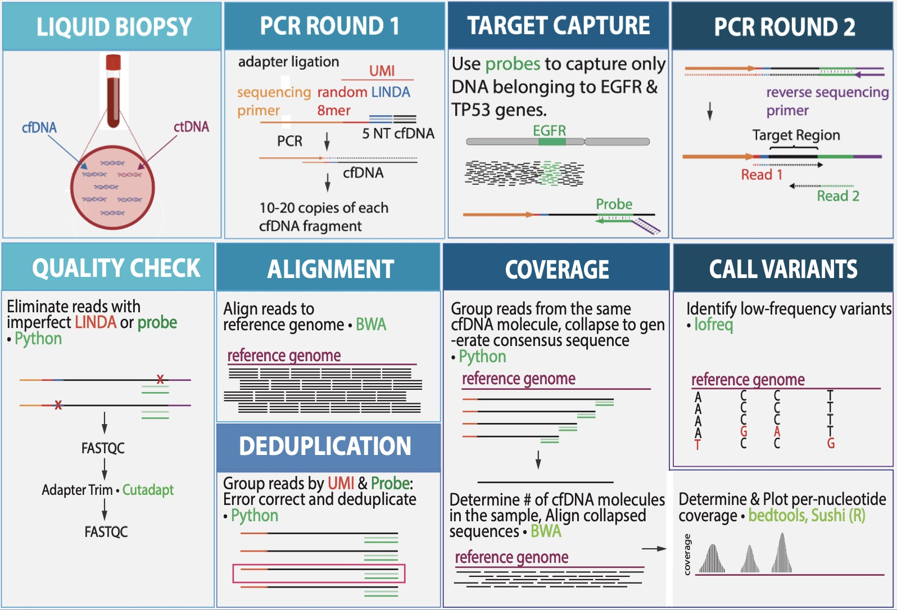

# Cancer detection by genomic analysis of cell-free DNA 

## Project Members: Sneha Challa1, Nora Kearns1, Thomas Persse1, Chris Raymond, PhD2

### Project Goal:
We sought to create a portable bioinformatic pipeline for performing variant calling on cell free DNA (cfDNA) collected from liquid biopsies, with an end goal of detecting recurrent cancer.

### Workflow: 

!

(Include portion here about what the molecular biology prep involved) During quality assessment, reads with imperfect LINDA and/or probe sequences were eliminated, then adapters were trimmed. Remaining reads were then aligned to the ensembl reference human genome, then deduplicated and error corrected using Connor [1]. Coverage was determined by generating consensus cfDNA fragments from the reads, then determining the number of fragments per position within EGFR and TP53. Finally, variant calling was performed using lofreq. Software incorporated into final pipeline is indicated in green.
